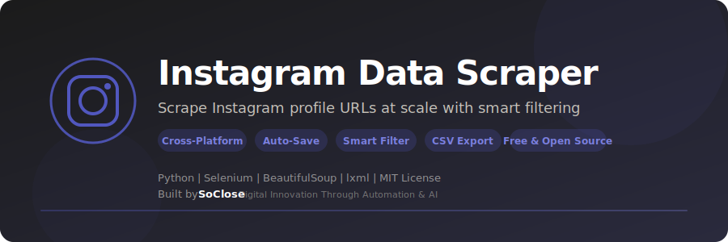

<p align="center">
  
</p>

<p align="center">
  <strong>Scrape Instagram profile URLs at scale — automated scrolling, smart filtering, clean CSV export.</strong>
</p>

<p align="center">
  <a href="LICENSE"></a>
  <a href="https://www.python.org/downloads/"></a>
  
  <a href="https://www.selenium.dev/"></a>
  <a href="https://github.com/SoCloseSociety/InstagramDataScraper/stargazers"></a>
  <a href="https://github.com/SoCloseSociety/InstagramDataScraper/issues"></a>
  <a href="https://github.com/SoCloseSociety/InstagramDataScraper/network/members"></a>
</p>

<p align="center">
  <a href="#quick-start">Quick Start</a> &bull;
  <a href="#key-features">Features</a> &bull;
  <a href="#configuration">Configuration</a> &bull;
  <a href="#faq">FAQ</a> &bull;
  <a href="#contributing">Contributing</a>
</p>

---

## What is Instagram Data Scraper?

**Instagram Data Scraper** is a free, open-source **Instagram profile extraction tool** built with Python and Selenium. It automates the collection of Instagram profile URLs from any page — feed, hashtag, explore, followers — with smart filtering and deduplication.

Need to build a prospect list, analyze followers, or study engagement patterns? Manually copying profiles is slow and tedious. This scraper handles login, scrolling, extraction, deduplication, and CSV export in one command.

### Who is this for?

- **Growth Hackers** building lead lists for outreach campaigns
- **Digital Marketers** studying competitors' follower bases
- **Data Analysts** collecting social media datasets
- **Researchers** studying engagement patterns and influencer networks
- **Startup Founders** identifying potential customers or partners
- **Developers** learning Selenium browser automation

### Key Features

- **One-Command Setup** - Clone, install, run — scraping in under 2 minutes
- **Smart Login** - Automated Instagram authentication via Selenium
- **Infinite Scroll** - Continuous feed scrolling with auto-stop detection
- **Profile Filtering** - Extracts only profile URLs, skips /explore/, /reels/, /settings/
- **Deduplication** - Built-in set() ensures zero duplicate profiles
- **Human-Like Delays** - Randomized scroll timing (0.8s-2.0s) to mimic real behavior
- **Auto-Save** - Progress saved every 50 iterations — never lose data
- **Graceful Stop** - Press Ctrl+C anytime — all collected data is saved
- **Secure Credentials** - .env file support — credentials never in code
- **Clean CSV Output** - Full Instagram URLs, sorted alphabetically, UTF-8 encoded
- **Free & Open Source** - MIT license, no API key required

---

## Quick Start

### Prerequisites

| Requirement | Details |
|-------------|---------|
| **Python** | Version 3.10 or higher ([Download](https://www.python.org/downloads/)) |
| **Google Chrome** | Latest version ([Download](https://www.google.com/chrome/)) |
| **Instagram Account** | A valid Instagram account |

### Installation

```bash
# 1. Clone the repository
git clone https://github.com/SoCloseSociety/InstagramDataScraper.git
cd InstagramDataScraper

# 2. (Recommended) Create a virtual environment
python -m venv venv

# Activate it:
# Windows:
venv\Scripts\activate
# macOS / Linux:
source venv/bin/activate

# 3. Install dependencies
pip install -r requirements.txt
```

### Configure Credentials

```bash
cp .env.example .env
```

Edit `.env`:

```env
INSTA_USERNAME=your_username_or_email
INSTA_PASSWORD=your_password
```

> Skip the `.env` file to enter credentials at runtime instead.

### Usage

```bash
python main.py
```

**What happens:**
1. Chrome opens and logs in to Instagram
2. You navigate to the page you want to scrape (feed, hashtag, explore...)
3. Press **ENTER** to start
4. The scraper scrolls and collects profile links automatically
5. Results are saved to a `.csv` file

Press **Ctrl+C** at any time to stop and save.

---

## How It Works

```
┌──────────────┐    ┌──────────────┐    ┌─────────────────┐    ┌───────────┐
│ Chrome opens │───>│ Login to     │───>│ Scroll & extract │───>│ Export to │
│ via Selenium │    │ Instagram    │    │ profile links    │    │ CSV file  │
└──────────────┘    └──────────────┘    └─────────────────┘    └───────────┘
                                               │
                                        ┌──────┴──────┐
                                        │ Deduplicate │
                                        │ + filter    │
                                        └─────────────┘
```

---

## Output Format

```csv
ProfileLink
https://www.instagram.com/alice/
https://www.instagram.com/bob/
https://www.instagram.com/charlie/
```

---

## Configuration

Edit the constants at the top of `main.py`:

| Variable | Default | Description |
|----------|---------|-------------|
| `MAX_STALE_ITERATIONS` | `500` | Stop after N iterations with no new links |
| `SCROLL_PAUSE_MIN` | `0.8s` | Minimum delay between scrolls |
| `SCROLL_PAUSE_MAX` | `2.0s` | Maximum delay between scrolls |
| `SCROLL_AMOUNT` | `600` | Pixels to scroll down per iteration |
| `SAVE_INTERVAL` | `50` | Save to CSV every N iterations |

---

## Tech Stack

| Technology | Purpose |
|------------|---------|
| [Python 3.10+](https://python.org) | Core language |
| [Selenium 4.x](https://selenium.dev) | Browser automation |
| [BeautifulSoup4](https://beautiful-soup-4.readthedocs.io) | HTML parsing |
| [lxml](https://lxml.de) | Fast HTML parser backend |
| [python-dotenv](https://pypi.org/project/python-dotenv/) | Environment variable management |
| [webdriver-manager](https://pypi.org/project/webdriver-manager/) | Automatic ChromeDriver setup |

---

## Project Structure

```
InstagramDataScraper/
├── main.py              # Core scraper script
├── requirements.txt     # Python dependencies
├── .env.example         # Credential template
├── assets/
│   └── banner.svg       # Project banner
├── pyproject.toml       # Python project metadata
├── CONTRIBUTING.md      # Contribution guidelines
├── LICENSE              # MIT License
├── README.md            # This file
└── .gitignore           # Git ignore rules
```

---

## Troubleshooting

### Chrome driver issues

```bash
pip install --upgrade webdriver-manager
```

### Login fails

If the automated login doesn't work:
1. Check your credentials in `.env`
2. Instagram may require 2FA — complete it manually in the browser window
3. Try logging in manually first, then press ENTER to start scraping

### No profiles found

If the scraper scrolls but doesn't find profiles:
1. Make sure you navigated to a page with profile links (feed, hashtag page, followers list)
2. Instagram may have changed its HTML structure — open an issue

---

## FAQ

**Q: Is this free?**
A: Yes. Instagram Data Scraper is 100% free and open source under the MIT license.

**Q: Do I need an Instagram API key?**
A: No. This tool uses browser automation (Selenium), no API key needed.

**Q: How many profiles can I scrape?**
A: No hard limit. The scraper runs until no new profiles are found for 500 consecutive iterations. Be mindful of Instagram's usage policies.

**Q: Are my credentials safe?**
A: Credentials are stored in a local `.env` file that is gitignored. They are never uploaded or shared.

**Q: Can I scrape hashtag pages?**
A: Yes. After login, navigate to any hashtag page, press ENTER, and the scraper will collect profile links.

**Q: Does it work on Mac / Linux?**
A: Yes. Fully cross-platform on Windows, macOS, and Linux.

---

## Alternatives Comparison

| Feature | Instagram Data Scraper | Manual Copy-Paste | Instagram API | Paid Tools |
|---------|----------------------|-------------------|--------------|-----------|
| Price | **Free** | Free | Free (limited) | $30-100/mo |
| Bulk extraction | Yes | No | Rate limited | Yes |
| Profile filtering | Yes | Manual | N/A | Varies |
| Open source | Yes | N/A | No | No |
| API key required | No | No | Yes | Yes |
| Cross-platform | Yes | Yes | Any | Web only |

---

## Contributing

Contributions are welcome! Please read the [Contributing Guide](CONTRIBUTING.md) before submitting a pull request.

---

## License

This project is licensed under the [MIT License](LICENSE).

---

## Disclaimer

This tool is provided for **educational and research purposes only**. Scraping Instagram may violate their [Terms of Service](https://help.instagram.com/581066165581870). The authors are not responsible for any misuse or consequences resulting from the use of this software. Always respect platform policies and applicable laws.

---

<p align="center">
  <strong>If this project helps you, please give it a star!</strong><br>
  It helps others discover this tool.<br><br>
  <a href="https://github.com/SoCloseSociety/InstagramDataScraper">
    
  </a>
</p>

<br>

<p align="center">
  <sub>Built with purpose by <a href="https://soclose.co"><strong>SoClose</strong></a> &mdash; Digital Innovation Through Automation & AI</sub><br>
  <sub>
    <a href="https://soclose.co">Website</a> &bull;
    <a href="https://linkedin.com/company/soclose-agency">LinkedIn</a> &bull;
    <a href="https://twitter.com/SoCloseAgency">Twitter</a> &bull;
    <a href="mailto:hello@soclose.co">Contact</a>
  </sub>
</p>
